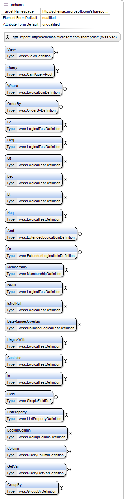

# WSS.XSD

A C# .NET Standard 2 library for programmatically writing [CAML queries](https://docs.microsoft.com/en-us/previous-versions/office/developer/sharepoint-2010/ms462365(v=office.14)) and generating SharePoint schema XML. This library supports all the querying capabilities of CAML, and most of the core SharePoint-related schema XML, from Site, List, Field and View definitions to also Workflow and Content Type definition schema. It exposes a comprehensive,high-level, strongly typed object API that represents language elements in CAML and SharePoint schema. 

It is a work in progress and as of July 2019 is in early stages, but as most of the code in this library is itself generated by [LinqToXsdCore](https://github.com/mamift/LinqToXsdCore), there's already a lot of useful functionality here. 

## Compatibility

The library itself is built against [.NET Standard 2](https://docs.microsoft.com/en-us/dotnet/standard/net-standard).

### SharePoint Compatibility

The generated CAML and schema XML should be compatible with SharePoint 2010, 2013, 2016 and 2019. The CAML should also be compatible with SharePoint online (though the schema XML for provisioning Sites, Lists, View etc. most likely is not, because provisioning site assets works differently).

### Limitations

At the moment it cannot be used for reading CAML (or de-serialising raw CAML XML text into an object graph), due to the peculiar way CAML is defined in the `wss.xsd` schema file.

## What can I do with this?

Consider a CAML query in its raw XML form such as this:
```XML
<Query>
  <Where>
    <And>
      <Eq>
        <FieldRef Name="State" />
        <Value Type="Text">Queensland</Value>
      </Eq>
    </And>
  </Where>
</Query>
```

Using the [client-side object model](https://docs.microsoft.com/en-us/previous-versions/office/developer/sharepoint-2010/ee537247(v=office.14)) in SharePoint, you would put the above as a C# string and then pass it to your client context to execute. If you wanted to generalise your query logic so that 'Queensland' or 'Australia' isn't hard coded, then you would have to do something like this:

```C#
var val = string.Format("<Value Type=\"Text\">{0}</Value>", "Queensland or some other state");
```

And the same is true for the FieldRef:

```C#
var fieldRef = string.Format("<FieldRef Name=\"{0}\" />", "State or geographical region");
```

Like in SQL, this gets really annoying real fast, especially when you need to generalise your query logic; but unlike SQL, CAML **is XML**, so you end up writing the actual abstract syntax tree in code, including `<opening>` and `<closing>` tags - this makes writing raw CAML much more laborious than SQL, especially in complex queries. This library allows you to write CAML code as pure C# code, modelling elements and their attributes that make up CAML as C# objects and properties that are children and parents of one another. The same query from above, using this library, is now:

```C#
var queryDef = new CamlQueryRoot {
  Where = new LogicalJoinDefinition {
    And = {
      new ExtendedLogicalJoinDefinition {
        Eq = {
          new LogicalTestDefinition {
            FieldRef = FieldRefDefinition.FromNames("State"),
            Value = ValueDefinition.NewTextValues("Queensland")
          }
        }
      }
    }
  }
};
```

You'll note that the type names are different, as they match the built-in schema types defined in the `wss.xsd` file (the schema that defines the CAML language itself).

This manner of writing CAML queries also allows you to modify the XML tree using strongly-typed C# logic on the object graph. Consider this code:

```C#
queryDef.Where.And.First().Eq.Add(new LogicalTestDefinition {
  FieldRef = FieldRefDefinition.FromNames("Country"),
  Value = ValueDefinition.NewTextValues("Australia")
});
```

..when executed, adds the following to the `<And>` clause:

```XML
<Eq>
  <FieldRef Name="Country" />
  <Value Type="Text">Australia</Value>
</Eq>
```

...so the full query is now:

```XML
<Query>
  <Where>
    <And>
      <Eq>
        <FieldRef Name="State" />
        <Value Type="Text">Queensland</Value>
      </Eq>
      <Eq>
        <FieldRef Name="Country" />
        <Value Type="Text">Australia</Value>
      </Eq>
    </And>
  </Where>
</Query>
```

To get the CAML XML text, use the `ToCamlString()` method, which will return the above XML as a regular C# string:

```C#
var camlString = queryDef.ToCamlString();
```

### Untyped LINQ to XML

You can also access the object graph as a hierarchy of regular `XElement` objects (and use LINQ to XML to query and manipulate the tree); each object type in this library exposes an `Untyped` property that returns an `XElement` of itself (and anything underneath it). For instance on the `<Query>` object, you can query for all `<And>` clauses like so:

```C#
var andClauses = queryDef.Untyped.Descendants()
                  .Where(d => d.Name.LocalName == "And").ToList();
```

### CAML querying support list

Here's an abbreviated list of supported elements (for querying):



The library itself contains defined types for other CAML language constructs besides the above. View the `wss.xsd` file in Visual Studio or in XSD editor such as Altova XML or Oxygen XML to see the complete list.

## Rationale

Writing CAML by hand is an awful experience. How Microsoft did it is a mystery, but CAML, despite being designed and written in the 2000's, is an even worse language for querying data than SQL, which first emerged in the 1970's. Granted CAML isn't *just* a querying langauge, but tooling for using its querying facilities could be improved.

Also, you may notice that the WSS.XSD C# version of a CAML query definitely has more characters, but note you're not writing those extra characters by hand: Visual Studio's intellisense autocomplete will end up suggesting the full type name, and an inferred order of types for you. For instance, the `<Eq>` and other CAML logical test operators (`<BeginsWith>`, `<Contains>` etc.) can only appear nested as children under `<Where>`, `<And>` and `<Or>` clauses; the C# compiler will itself enforce this because the foundational schematics of the language have been modelled by the C# code in this library, thus reducing potential errors when writing CAML logic.

### Future features

Writing a client-side LINQ-to-SharePoint provider (through the use of `IQueryable` expression translation) is a long-term goal, but no where near implemented at the moment.

As far as I can tell, no client-side equivalent of [spmetal](https://docs.microsoft.com/en-us/previous-versions/office/developer/sharepoint-2010/ee538255(v=office.14)) exists yet, but this library is a stepping stone towards building one.

# Colophon

The library itself is named after the file name of the W3C XML Schema that defines CAML (`wss.xsd`), the 'wss' part, being an abbreviation of 'Windows SharePoint Services', which was an early name for SharePoint.